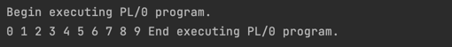
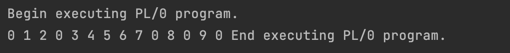
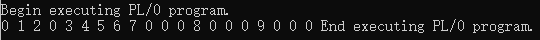

# 编译原理实验二实验报告

组内成员：  

- 徐姝玮 PE20110008
- 王晨 PE20060014
- 伍少枫 PE20110007

完成日期：2021年12月28日

## 1.实验要求

​	以课程链接上的供参考的 PL/0 实验（2017 版）为基础，给 PL/0 语言添加数组实现。这可能涉及到“上机实践要求”的：

1. 第（3）项（数组声明语法）。
2.  第（6）项（print 输出功能）。
3.  第（13）项（数组初始化，必须考虑数组声明中第一维是空的情况）。

## 2.实验思路 

​	本次实验的任务为向PL/0编译器内添加数组功能，而数组功能实际上由下面几个部分组成：

1. 数组的声明(基本情况)：例如`var a[10][10]`，这种情况下，需要识别`a`为数组类型并存入符号表内，并且还需要读取后面的各个维度大小的说明，由于数组的各维度大小是确定的，因此可以在分析完后立刻分配空间。
2. 数组元素的赋值：如果数组变量已经声明，那么在后续的语句中可以对数组元素进行赋值，例如`a[1][1] := 10;`，更复杂的情况为**方括号内的维度可以是一个常数变量、变量、表达式**。
3. 数组元素访问用于计算：如果数组变量已经声明，那么在后续的语句中可以访问数组元素，利用其值来参与表达式的计算，例如`b:=2+3*a[0][1]/6;`等。
4. 内置函数`print`：内置函数实际上是用来进行debug的，其“参数”可以是零个或多个数字、常数变量、变量、数组元素。

## 3.源码分析说明	

​	实验的源代码文件以及相关文件包括以下文件：

- pl0.c：PL/0源代码文件，其中包含递归下降文法的函数定义、一些辅助函数定义、编译器函数定义、汇编代码生成以及展示代码、运行PL/0语言的虚拟机函数定义、主函数等。
- PL0.h：PL/0源代码头文件，其中包含基本所有全局变量(例如符号表项数量`tx`等)、特殊量的宏定义、符号表结构、词法符号类型、保留关键字、汇编代码操作码、错误类型和信息等的定义
- set.c：包含词法符号类型集合的定义，其使用链表实现，主要的功能是作为递归下降函数的参数，用于检查首符号、后继符号是否正确从而进行相应的报错，并且使得错误出现时语法分析跳过指定的符号以继续分析。
- set.h：`set.c`中函数的声明。
- plcc：gcc编译得到的可执行文件，在实验结果演示部分会使用。


​	下面主要对`pl0.c`文件内的源代码以及头文件`PL0.h`中新增的定义按照功能分块进行说明。

### 3.1.数组在符号表中的管理

​	本部分主要说明如何拓展符号表的结构，使得数组变量以及相关的维度信息可以存储在其中。

​	如下是原来的符号表中表项的结构体定义。对于常数变量，可直接将其值存在`value`成员变量内；对于变量，则需要将4字节的`value`域拆开为两个`short`类型的域，用于存放定义的层次以及存储地址；对于过程，其只使用`level`域存放其定义层次，无需使用`address`。上述创建符号表项的工作由`void enter(int kind)`函数完成。

```c
typedef struct
{
	char name[MAXIDLEN + 1];
	int  kind;
	int  value;
} comtab;

comtab table[TXMAX];//symbol table

typedef struct
{
	char  name[MAXIDLEN + 1];
	int   kind;
	short level;
	short address;
} mask;

FILE* infile;
```

​	由于数组变量声明需要同时存放其必要的一些维度信息，因此原来的符号表不足以满足数组实现的需要。秉着**向前兼容**的原则，我们对符号表做如下拓展：

1. 另外设置一个数组信息表，其中每一项是一个结构体，用于存放数组的大小、维度、维度大小、起始地址等信息。
2. 对于数组元素的符号表项，无需做改造，但是其`address`域需要存放**对应数组信息在数组信息表内的索引或者说下标**。

​	上述实现的逻辑结构可以参考下图。通过这样的实现，我们在原有符号表实现的基础上，为数组变量存放了额外的信息，便于后续实现数组元素访问等功能。


​	上述逻辑实现的一部分代码实现如下。这部分代码作为`switch...case...`语句的一种情况添加在`enter()`函数内。要注意的是，这部分代码的功能是在符号表内添加数组变量表项、在数字信息表内添加对应数组的表项并让前者`address`指向后者，实际上只进行了初始化工作，存储空间的分配以及各维度的大小等信息填写要在分析到相应维度的位置才能进行。

```c
// enter object(constant, variable or procedure) into table.
void enter(int kind)
{
    ...
    switch(kind){
    ...
    case ID_ARRAY:
        mk = (mask*) &table[tx];
        mk->level = level;
        mk->address = arr_tx;//// add new entry in symble table and array table
        pa = &(array_table[arr_tx]);
        array_table[arr_tx].dim = 0; 
        array_table[arr_tx].size = 1; 
        array_table[arr_tx].dim_size[1] = 0; // this place is set to zero in order to judge if first dimension is set by following analysis.
        arr_tx++;
        //dx has to wait until all dimensions analyzed
        break;
    ...
    }
}
```


### 3.2.数组变量声明
//to do初始化部分可以就写在这
//第一维为空的情况写在了3.4 你也可以挪到这里来


### 3.3.数组变量访问

#### 3.3.1.PL/0指令集扩展

​	为了方便数组元素寻址，我们拓展了PL/0指令集，拓展的指令包括如下三条指令。

##### LEA

​	`LEA`指令形式为`LEA l a`，功能为计算由`l`和`a`指示的变量的地址偏移，并放置在栈顶。其在`interpret`函数内的代码如下。

```c
case LEA:
    stack[++top] = base(stack, b, i.l) + i.a;
    break;
```

##### LDA

​	`LDA`指令的形式为`LDA 0 0`，功能为以栈顶内容为地址偏移，将对应位置的值加载到栈顶替换原来的栈顶。其在`interpret`函数内的代码如下。

```c
case LDA:
    stack[top] = stack[stack[top]];
    break;
```

##### STA

​	`STA`指令的形式为`STA 0 0`，功能为以次栈顶内容为地址偏移，将栈顶的值存入到次栈顶指示的单元，并将栈顶和次栈顶出栈。其在`interpret`函数内的代码如下。

```c
case STA:
	stack[stack[top-1]] = stack[top];
    top = top -2;
    break;
```

​	上述指令能够帮助我们更方便地加载数组变量基址，以及通过基址+偏移计算得到的地址来加载数组元素。

#### 3.3.2.数组变量赋值

​	数组变量赋值的功能需要完成如下几个子功能：

1. 数组变量作为赋值语句的首符号。
2. 读取数字变量的维度索引，生成计算偏移的汇编代码序列。这里要支持表达式作为索引。
3. 生成将右值加载到对应数组元素单元的汇编代码。这里同样要支持表达式作为右值。

​	上述功能作为一种产生式情况添加在`statement`函数的赋值语句情况下。基本代码如下。

```c
void statement(symset fsys){
    ...
	if (sym == SYM_IDENTIFIER)
	{ // variable assignment, added array element as left value
		mask* mk;
		if (! (i = position(id)))
		{
			error(11); // Undeclared identifier.
		}
		...
		else if(table[i].kind == ID_ARRAY){
		    //use a recursive function array_visit to read through brackets to calculate address. At the same time, generate neccessary code to calculate expressions between brackets.
		    //always use the two value on stack top to calculate accumulated size and store next dimension value
		    mk = (mask*) &table[i];
		    arr_index = mk->address;//index in array table
		    gen(LEA,level - mk->level,array_table[arr_index].address);//in the end, start address - offset
		    gen(LIT,0,0);//add with 0 first 
		    set1 = createset(SYM_RSQUAREBRACKET);
		    array_visit(arr_index,0,set1);//for expression, it can only be followed by ] in this case
		    //getsym(); array_visit already get next symbol
		    if(sym!= SYM_BECOMES){error(13);}
		    gen(OPR, 0, OPR_MIN);//top-1 - top -> top-1
		    getsym();
		    expression(fsys);//right value, move to top 
		    if (i){//use STA instruction
		        gen(STA, 0, 0);//calculated value on stack top, address should be calculated above
		    }
		}//array element assignment
    ...
	}
    ...
}
```

​	对于数组元素的赋值语句，上述代码对应的产生式如下：
$$
\begin{aligned}
statement \rightarrow \ & ID\_ARRAY \ \ ARRAY\_VISIST \ := \ expression ;\\
ARRAY\_VISIST \rightarrow \ & [\ expression\ ]\ ARRAY\_VISIST  \\
&| \ \epsilon
\end{aligned}
$$
​	其中$ARRAY\_VISIT$非终结符对应的分析函数如下。该函数的作用为分析数组元素中维度部分，并同时生成计算地址偏移的代码。

```c
//array_visit
void array_visit(short arr_index,int dim,symset fsys){//dim means number of dimensions that has been analyzed
    getsym();
    if(sym==SYM_LSQUAREBRACKET){
        //check brackets
        //if(sym!=SYM_LSQUAREBRACKET){error(35);}//missing '['
        gen(LIT,0,array_table[arr_index].dim_size[dim+1]);
        gen(OPR,0,OPR_MUL);//multiply top two
        getsym();
        expression(fsys);//if not an expression, error will be raised by expression(), ']' check is done in expression()
        //getsym(); expression already get next symbol
        // Note: offset overflow will check by runtime
        gen(OPR, 0, OPR_ADD);//add calculated offset to multiplied number
        array_visit(arr_index,dim+1,fsys);//visit next dimension 
    }
    else if(dim!=array_table[arr_index].dim){error(34);}//missing dimensions
    //test
} 
```

​	下面结合上述代码，说明如何生成计算偏移量的汇编代码。当检测到首符号为`ID_ARRAY`时，首先生成的代码为：

```
LEA level - mk->level 	array_table[arr_index].address
LIT	0					0
```

​	这里计算了数组首地址并放在栈顶，然后向栈顶加载一个0，这是为了保证后续计算偏移的正确性，接下来会加以说明。接着调用`array_visit`函数开始分析数组元素的维度部分，这里要注意的是传入的参数或者说继承属性为符号集合，该集合只包含右方括号`RSQUAREBRACKET`，这是为了在分析方括号中维度时，检查后继符号是否为右方括号。

​	进入`array_visit`函数后，按照上面提到过的文法来递归调用。而翻译方案有如下步骤：

1. 若当前符号为左方括号，生成代码，将继承属性`dim`对应的维度的大小加载到栈顶，并生成代码，将栈顶两数相乘并替换栈顶和次栈顶。可以看到，这样做的目的是用已经积累的偏移乘以当前维度的大小。
2. 调用`expression(fsys)`后，栈顶此时有了`dim`维度的索引值，生成代码将栈顶和次栈顶相加，得到到`dim`维为止积累的所有偏移值。然后递归调用`array_visit()`即可。

​	上述步骤生成的代码为：

```
LIT	0	array_table[arr_index].dim_size[dim+1]
OPR 0	OPR_MUL
OPR	0	OPR_ADD
```

​	`array_visit`函数调用返回之后，其生成的代码计算得到偏移值，并保存在栈顶，次栈顶保存的是数组首地址。因此接下来生成的代码需要通过栈顶和次栈顶计算数组元素地址并放在栈顶，以及计算右表达式的值，并放在栈顶，最终将栈顶值加载到次栈顶指示的单元内。上述过程对应代码如下：

```
OPR	0	OPR_MIN
STA 0	0
```

​	综上，在`statement`内添加新的数组元素赋值表达式，生成一系列代码，计算数组元素的地址，从而可以将对应值加载到数组元素单元内。另外，由于代码编写可能存在数组元素维度越界的情况，对于这种情况，由于**总偏移一定是在运行时才能计算得到的**，因此对于越界的检查以及报错无法在文法部分完成。可以考虑在代码过程中，在计算得到总偏移后人工插入一条检查总偏移大小和数组`size`大小的指令来完成数组越界的检查和报错。


#### 3.3.3.数组变量参与表达式运算

​	数组变量参与表达式运算需要扩展`factor`的产生式，即表达式的最小因子可以是一个数组元素。由于在3.3.2部分已经阐述了如何翻译数组元素，因此这一部分只需要复用代码即可。对应的代码如下：

```c
void factor(symset fsys)
{
    ...
    switch (table[i].kind)
		{
            ...
            case ID_ARRAY: //add array element as factor
                mk = (mask*) &table[i];
                arr_index = mk->address;//index in array table
                mk = (mask*) &table[i];
                gen(LEA,level - mk->level,array_table[arr_index].address);//in the end, start address - offset
                gen(LIT,0,0);//add with 0 first 
                set = createset(SYM_RSQUAREBRACKET);
                array_visit(arr_index,0,set);
                //if(sym!= SYM_RPAREN){error(13);}
                //getsym(); array_visit already get next symbol
                gen(OPR, 0, OPR_MIN);//top-1 - top -> top-1
                gen(LDA, 0, 0);//use LDA to load array element to top 
                break;    
            ...
    	}
  	...
}
```

​	上述代码对应生成的汇编代码与3.3.2中数组元素作为左值非常相似，因为都是在计算数组元素的偏移和地址，最后的结果为将数组元素的值加载到栈顶，这与其他的情况(常数、变量)是一致的。

### 3.4.数组初始化时第一维为空的情况
#### 3.4.1.功能
1.形如a[ ][2]={1,2,3,4}的情况，由于第一维为空必须存在与数组初始化时，只需要根据初始化时元素的个数，计算出第一维的实际维度填入即可。
#### 3.4.2.实现
我们当前的版本数组初始化和初始化时第一维为空的功能是两个独立的函数，互不影响。
初始化由`initializer`函数实现，而第一维为空的情况视为数组声明的一个分支情况，写在`dimdeclaration`中。

在实现此功能时，我们采用了保存现场->向后搜索初始化元素->计算第一维并填入->恢复现场的思想。

当在数组声明中分析到左括号'['紧接右括号']'时，则判断出现了为空的维度，此时必须保证该维度为第一维，否则抛出错误。并暂时先将第一维的dim_size设为0。
```c
 case SYM_RSQUAREBRACKET:
                //a[][2]={1,2,3,4}
                //first dimension is empty, added by Chen Wang,30/11/2021
                //And if the first dimension is empty, use initilization to fill in that dimension
                if(pa->dim!=0){
                    error(39);
                }//the empty dimension must be the first one
                pa->dim = pa->dim + 1;
                pa->dim_size[pa->dim] = 0;
                pa->size = pa->size * 1;
                getsym();
                dimdeclaration();
                break;
```
此后进行缺失第一维的计算，首先保存现场，向后搜索初始化的元素个数，除以其他维数的和，就是第一维的值，填入后恢复现场即可。代码如下：
```c
else {
            //first dim empty,look forward to fill the first dim
            int savecc=cc;
            char savech=ch;
            int savesym=sym;
            int cntnumber=0;
            int cntdimsize=0;
            //read until id or  ";"
            getsym();
            while(sym!=SYM_SEMICOLON && sym!=SYM_IDENTIFIER ){
                if(sym==SYM_NUMBER)
                    cntnumber++;
                getsym();
            }
            pa->size = cntnumber;
            for(int i=1;i<=pa->dim;i++){
                cntdimsize+=pa->dim_size[i];
            }
            pa->dim_size[1] = pa->size/cntdimsize;
            dx += pa->size;
            pa->address = dx - 1;
            printf("allocate for array: %d\n", dx - 1);
            printf("total dim %d,first dim size %d\n", pa->dim,pa->dim_size[1]);
            cc = savecc;
            ch = savech;
            sym = savesym;
		}
```


### 3.5.内置print()函数

#### 3.5.1.功能

​	`print()`函数的功能为：

1. 当没有参数时，输出换行符`'\n'`。
2. 当有参数时，依次输出参数的值。

#### 3.5.2.实现

​	由于我们使用的PL/0原有代码不包含含参过程调用相关实现，并且`print()`函数的功能比较简单，因此我们采用**将print**作为保留关键字的方法来实现内置的输出函数。`print`作为关键字的词法符号名称为`SYM_PRINT`。

​	接下来，因为原有的PL/0指令集中不包含输出相关的汇编指令，因此我们这里还对指令集进行了拓展，加入了`PRT`指令。其形式为`PRT 0 a`，功能为逆序打印栈顶的a个单元的内容，并从栈中弹出这些内容。在语法分析时，将每个参数的值加载到栈顶，最后生成`PRT`指令，就可以将参数的值按顺序打印。`interpret()`函数内对应的情况如下：

```c
void interpret()
{
    ...
	case PRT:
		    if(i.a==0){printf("\n");}
		    else{
		        for(int k=i.a-1;k>=0;k--){
		            printf("%d ",stack[top-k]);//print argument's value one by one
		        }
		        top = top - i.a;//arguments are collected
		    }
		    break;
   ...
}
```

​	最后，对于`print`关键字的文法如下：
$$
\begin{aligned}
statement \rightarrow \ & print (E) \\
E \rightarrow \ & SYM{\_}IDENTIFIER\ , E  \\
&| \ SYM{\_}IDENTIFIER\ \ ARRAY\_VISIT\ , E  \\
&| \ \epsilon
\end{aligned}
$$
​	其中在具体实现时，要注意`SYM_IDENTIFIER`的类型只能是`ID_CONSTANT`,`ID_VARIABLE`和`ID_ARRAY`，并且如果为`ID_ARRAY`类型，还要接着分析方括号组成的维度索引。这里暂时不支持表达式作为参数，原因是我们主要使用`print`函数来输出变量值从而debug，如果后续有需要，加入表达式作为参量也非常容易。

​	下面依次分析`print()`函数的具体代码实现。`print`作为`statement`产生式中的一种情况，被放在`statement`函数中。分析完`SYM_PRINT`关键字后，读取左括号，然后进入循环（也可写成递归的），不断读取参数，并用`count`计数，直到读取到右括号为止。最后生成`PRT`汇编指令，逆序输出`count`个栈顶值。

```c
else if(sym == SYM_PRINT){
	//print statement
	    getsym();
	    if(sym != SYM_LPAREN){error(28);}// wrong format for print
	    while(1){
            getsym();
	        if(sym == SYM_RPAREN){break;}
            ...
        }
    	gen(PRT,0,count); // generate code that print count positions in stack
	    getsym();
}
```

​	上述代码的`while`循环内省略的是分析不同参数的情况，代码如下。

```c
while(1){
    else if(sym == SYM_IDENTIFIER){
        count++;
        if ((i = position(id)) == 0){error(11); }// Undeclared identifier.
        else if(table[i].kind != ID_VARIABLE && table[i].kind != ID_ARRAY && table[i].kind != ID_CONSTANT)
        {
            error(29);// wrong argument type for print
        }
        else{ 
            if(table[i].kind == ID_VARIABLE){//variable
                mask * mk;
                mk = (mask*) &table[i];
                gen(LOD, level - mk->level, mk->address);//load the variable's value onto stack
                getsym();
            }
            else if(table[i].kind == ID_CONSTANT){
                gen(LIT,0,table[i].value);//load constant value onto stack
                getsym();
            }
            // array element to be added
            else if(table[i].kind==ID_ARRAY){
                int arr_index;
                mask * mk;
                mk = (mask*) &table[i];
                arr_index = mk->address;//index in array table
                mk = (mask*) &table[i];
                gen(LEA,level - mk->level,array_table[arr_index].address);//in the end, start address - offset
                gen(LIT,0,0);//add with 0 first 
                set1 = createset(SYM_RSQUAREBRACKET);
                array_visit(arr_index,0,set1);
                //if(sym!= SYM_RPAREN){error(13);}
                //getsym(); array_visit already get next symbol
                gen(OPR, 0, OPR_MIN);//top-1 - top -> top-1
                gen(LDA, 0, 0);//use LDA to load array element to top 
            }
            //getsym();
            if(sym == SYM_COMMA){;}
            else if(sym == SYM_RPAREN){break;}
            else{error(28);}//wrong format
        }
        //destroyset(set1);
    }
    else {
        if(sym == SYM_NUMBER){error(29);}// wrong argument type for print
        error(28);//wrong format 
    }
}
```

​	上述代码使用的辅助函数(例如array_visit())均已声明且使用过，使用方法不再赘述。对于不同的标识符类型，产生的汇编代码为如下情况：

1. `ID_VARIABLE`：产生`LOD level - mk->level mk->address`。

2. `ID_CONSTANT`：产生`LIT 0 table[i].value`。

3. `ID_ARRAY`：产生数组元素参与表达式运算时基本相同的汇编代码，包括如下指令。指令主要完成首地址的加载和偏移的计算，然后计算元素所在地址，然后加载其值到栈顶，这样就完成了数组元素的访问。

   ```
   LEA level - mk->level 	array_table[arr_index].address
   LIT 0 					0
   # zero or several following 3 instructions
   LIT 0					array_table[arr_index].dim_size[dim+1]
   OPR 0 					OPR_MUL
   OPR 0 					OPR_ADD
   ...
   
   OPR 0					OPR_MIN
   LDA 0					0
   ```

   

​	综上，`print`被作为保留关键字加入PL/0语言，其为`statement`的一种情况。通过递归下降分析其括号内参数，将合法参数的值依次加载到栈顶，最后通过`PRT`指令将这些值逆序打印并统一出栈。

### 3.6.数组初始化

#### 3.6.1.功能
    数组初始化时，根据数组中的值分配内存，包括缺失时补零。

#### 3.6.2.实现

##### 3.6.2.1.文法
    根据c语言规范得到如下文法：
        initializer:
	            num
                { initializer-list }
                { initializer-list , }
        initializer-list:
                initializer  initializer-list1
                ε
        initializer-list1:
                , initializer  initializer-list1
##### 3.6.2.2.翻译
    根据需要保留如下变量：
    ```c
        int current_level, max_level, array_index, array_dim;//level，最大level，数组相对偏移，数组维数
        int current_array[MAX_DIM + 1], max_array[MAX_DIM + 1];//每维当前数组下标，每维最大数组下标
        int array_full, before_Lbracket;//用于判断数组是否满，判断是否是{}的情况
        int judge_level[MAX_DIM + 1];//该维允许最大长度
        int bracketlevel[MAX_DIM + 1];//保存左括号的level
        int bl_index;//未匹配左括号数
    ```
###### 3.6.2.2.1.左括号
    对level做出判断，并保存该左括号的level，并将before_Lbracket置为1。
    ```c
        current_level = max(current_level + 1, levelbyindex());
        before_Lbracket = 1;
        bracketlevel[++bl_index] = current_level;
    ```
###### 3.6.2.2.2.NUM
    将NUM入栈保存，将before_Lbracket置为1，并将array_index++。
    ```c
        gen(LIT, 0, array_index++);
		gen(LIT, 0, num);
		gen(STI, 0, 0);
    ```
###### 3.6.2.2.3.右括号
    根据当前位置进行补零，并更新array_index++。
    这段代码太繁琐不直观，就不放代码了。

由此可以实现初始化时的翻译。
## 4.实验结果演示

### 4.1.代码编译方法

​	使用如下指令对`pl0.c`文件进行编译，得到目标文件`plcc`。

```bash
gcc -o plcc pl0.c
```

​	然后使用下列命令即可运行`plcc`程序，并按照提示选择需要编译的PL/0源代码文件。

```bash
./plcc
```

​	

### 4.2.测试文件以及程序运行情况

​	得到可执行文件`plcc`后，可以通过编写一个PL/0语言的源代码文件来进行编译运行，通过运行结果以及生成的汇编代码来检验程序的正确性。
这里采用了老师提供的测试程序进行测试。
#### 4.2.1 测试用例1的运行结果（../test1.txt）


#### 4.2.2 测试用例2的运行结果（../test2.txt）


#### 4.2.3 测试用例2的运行结果（../test2.txt）


## 5.实验总结

​	通过本次实验，我们从词法、文法、代码生成、代码运行等多个方面对PL/0编程语言有了了解，理解了PL/0语言文法设计、活动记录安排、嵌套结构实现、过程调用、符号表实现等多各方面的设计理念与技巧，并合作为PL/0语言添加了数组功能，具体而言包括：

1. 数组声明：包括普通的声明、第一维缺失的声明、声明同时初始化的功能。
2. 数组元素赋值。
3. 访问数组元素，使用数组元素进行计算。
4. 内置的`print()`函数，输出数字、常数变量、变量、数组元素的值。

​	另外，我们还向PL/0指令集、文法符号集、符号表等中添加了必要的新内容以方便文法符号识别、符号表管理、代码生成等过程。通过这次实验，我们对编程语言的实现以及编程语言实现中各个阶段有了更深入的理解。

## 6.组员贡献

伍少枫：

1. 完成数组变量在符号表中的表示以及存储空间分配、数组的声明、数组元素作为左值进行赋值、数组元素访问(在表达式中引用数组元素)。
2. 添加内置函数print(...)。
3. 向PL/0指令集添加STA, LDA, LEA, PRT指令。
4. 对代码加入大量注释以方便后续理解。
5. 完成实验报告中包含以上内容的部分。

王晨：

1. 添加数组声明初始化时第一维为空的功能。  
2. 对代码添加了大量注释，对PL/0指令集添加了指令说明的注释。  
3. 针对测试用例检查、修改代码。  
4. 编写实验报告及ppt。  

徐姝玮：

1. 完成数组初始化以及相关能用到的部分。
2. 完成实验报告中包含以上内容的部分。

## 7.参考

[1] PL/0实验文档(2017版)

[2] 编译原理与技术,2021课堂ppt